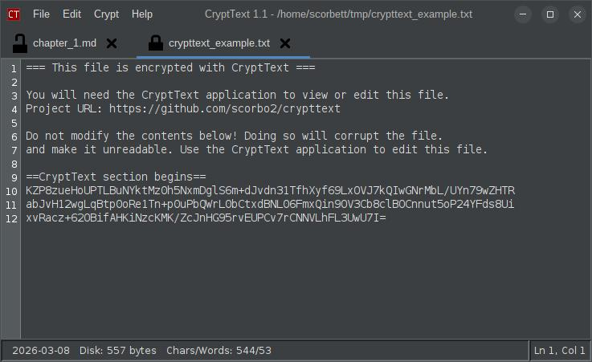
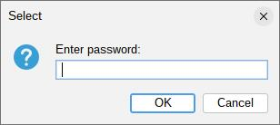
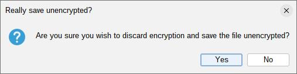
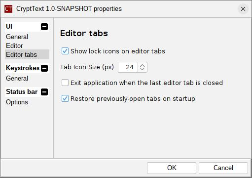
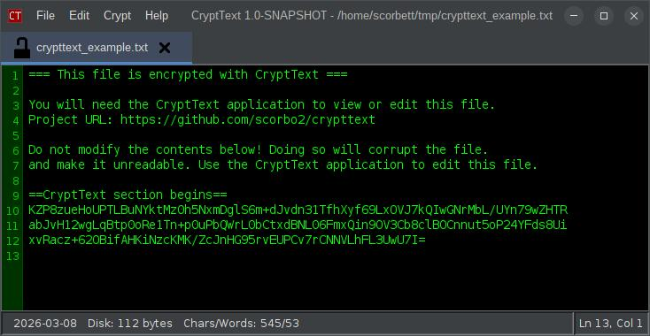

# CryptText

## What is this?

CryptText is a user-friendly, extensible text editor with built-in encryption and decryption.
Users can protect text files with a password without needing to know or care about the
underlying cryptography details.

Highlights in the 1.1 release include:

- Undo/redo support with configurable history depth
- Drag-and-drop opening from your file manager
- Live editor font size increase/decrease shortcuts
- Optional block cursor and configurable blink rate
- Interactive line-number gutter for selecting lines
- A built-in immersive full-screen writing mode



## How do I get it?

### Option 1: Installer tarball

If you are running on Linux, and have Java 17 or higher installed, you can download the installer tarball:

- [CryptText Installer](https://www.corbett.ca/apps/CryptText-1.1.tar.gz)
- Size: 17MB
- Sha256: `d5aa6243dd0c444f319d4b94ed2aac7a2d96b041220bf411f8e8b22eb25e5631`
- TODO update download info for 1.2 release

This is the best option, as you get an installer script that sets everything up for you:

- desktop shortcut
- shell integration (for right-clicking on text files and selecting "Open with CryptText")
- launcher script in your PATH (so you can run `CryptText` from the terminal)
- uninstaller script that removes all of the above

### Option 2: Build from source

You can clone the CryptText repository from GitHub and build it with maven:

```bash
git clone https://github.com/scorbo2/crypttext.git
cd crypttext
mvn clean package

# Run the executable jar that Maven created:
cd target
java -jar crypttext-1.2.jar
```

## User guide

### General usage

CryptText can be used as a regular text editor. Files can be opened or created in editor tabs.
You can open files from the File menu, by passing file paths on the command line, from the DirTree
extension, or by dragging files in from your desktop/file manager.

### Selecting lines from the gutter

If line numbers are enabled, clicking a line number selects that whole line. Clicking and dragging
in the gutter selects a range of lines, which is handy for quick block selection.

### Opening files via drag and drop

You can drag one or more files from your OS file manager directly onto the main window or an editor tab.
CryptText validates that dropped items are text files before opening them.

### Undo, redo, and font size shortcuts

CryptText 1.1 adds per-tab undo/redo support. By default, `Ctrl+Z` undoes the last change and `Ctrl+Y`
redoes it.

You can also adjust the editor font size on the fly with `Ctrl+Equals` and `Ctrl+Minus`. These changes
take effect immediately and are saved to your preferences.

### Encrypting

At any time, you can select "Encrypt/Decrypt" from the Crypt menu, or hit Ctrl+D (by default). This brings
up the "enter password" prompt, where you choose the password to use for encryption:



The text file is then encrypted. The encrypted payload is base64-encoded and embedded into a simple
wrapper file - this allows you to open the file in any other text editor, and see that it is encrypted
(instead of just seeing gibberish). The wrapper file provides instructions for how to get CryptText
to decrypt the file.

### Decrypting

When you open an encrypted wrapper file, you can hit Ctrl+D (or select "Encrypt/Decrypt" from the Crypt menu)
to bring up the password prompt. If you enter the correct password, the file will be decrypted in memory
and displayed in the editor. The contents on disk remain encrypted! Even if you make changes to the decrypted
text and save the file, the contents on disk will still be encrypted, using the same password you entered.

The general workflow is such that if text was loaded from an encrypted file, then the text content
will stay encrypted on disk. This is to prevent accidental saving of unencrypted text. If you really wish to save the
decrypted text, you must explicitly choose "Save unencrypted" from the File menu.
You will be prompted for confirmation before proceeding:



### Forgetting a password

If you have decrypted a file and wish to clear the remembered password (for example, before stepping away from your
desk), you can select "Forget Password" from the Crypt menu, or press F7 (by default). This clears the cached
password so that the next decrypt or encrypt operation will prompt for it again.

### Configuration options

CryptText has many options for changing the look and the behavior of the application, accessible via the Properties
dialog (Ctrl+P by default, or via the Edit menu):



#### General settings

| Option                           | Description                                                                                                                                                                                | Default      |
|----------------------------------|--------------------------------------------------------------------------------------------------------------------------------------------------------------------------------------------|--------------|
| Look and Feel                    | Selects the Swing Look and Feel for the entire application. CryptText ships with all the Look and Feels bundled by the `swing-extras` library, including FlatLaf variants and many others. | FlatLightLaf |
| Allow only a single instance     | When enabled, launching CryptText a second time will bring the existing instance to the foreground instead of opening a new window.                                                        | Enabled      |
| Show full file path in title bar | When enabled, the full path of the currently active file is shown in the window title bar. When disabled, only the application name and version are shown.                                 | Enabled      |
| Recent files                     | The maximum number of recently-opened files to remember and show in the File menu. Set to 0 to disable the feature.                                                                        | 10           |

#### Editor settings

| Option                                           | Description                                                                                                                                                                      | Default         |
|--------------------------------------------------|----------------------------------------------------------------------------------------------------------------------------------------------------------------------------------|-----------------|
| Editor Font                                      | The font used for text in the editor area.                                                                                                                                       | Monospaced 14pt |
| Gutter Font                                      | The font used for the line-number gutter alongside the editor.                                                                                                                   | Monospaced 12pt |
| Show line numbers in editor                      | Toggles the line-number gutter on or off.                                                                                                                                        | Enabled         |
| Use block cursor in editor                       | Replaces the usual caret with a block-style cursor for a more terminal-like editing feel.                                                                                        | Disabled        |
| Blink rate                                       | Controls cursor blink behavior. Choices are **Don't blink**, **Fast**, **Normal**, and **Slow**.                                                                                 | Normal          |
| Override Look and Feel with custom editor colors | When enabled, the options below become active and let you pick custom editor colors independent of the current Look and Feel.                                                    | Disabled        |
| Set from theme                                   | A quick-pick dropdown to apply a preset color scheme. Built-in themes include **Matrix**, **Dark**, **Very dark**, **Shades of grey**, **Got the blues**, and **Hot dog stand**. | Matrix          |
| Editor bg / Editor fg                            | Background and foreground colors for the editor area (only active when the override option above is enabled).                                                                    | Theme defaults  |
| Gutter bg / Gutter fg                            | Background and foreground colors for the line-number gutter (only active when the override option above is enabled).                                                             | Theme defaults  |

You can also override the Look and Feel and select custom color themes. Here is the "Matrix" theme, for example:



#### Editor tab settings

| Option                                              | Description                                                                                                               | Default |
|-----------------------------------------------------|---------------------------------------------------------------------------------------------------------------------------|---------|
| Show lock icons on editor tabs                      | When enabled, a small padlock icon is shown on each tab to indicate whether the file is currently encrypted.              | Enabled |
| Tab Icon Size (px)                                  | The size in pixels of the padlock icons on the tabs.                                                                      | 16      |
| Exit application when the last editor tab is closed | When enabled, closing the last open tab exits the application. When disabled, you are left with a blank window.           | Enabled |
| Restore previously-open tabs on startup             | When enabled, the files that were open the last time you closed CryptText are automatically re-opened on the next launch. | Enabled |
| Undo levels                                         | The maximum undo history to keep for each editor tab. Set to `0` to disable undo history entirely.                        | 100     |

#### Keyboard shortcuts

All keyboard shortcuts can be customized from the **Keystrokes** tab of the Properties dialog. The defaults are:

| Action             | Default Shortcut |
|--------------------|------------------|
| New Tab            | Ctrl+N           |
| Open File          | Ctrl+O           |
| Save File          | Ctrl+S           |
| Save File As       | Ctrl+Shift+S     |
| Save Unencrypted   | Ctrl+Shift+1     |
| Undo               | Ctrl+Z           |
| Redo               | Ctrl+Y           |
| Increase Font Size | Ctrl+Equals      |
| Decrease Font Size | Ctrl+Minus       |
| Encrypt/Decrypt    | Ctrl+D           |
| Forget Password    | F7               |
| Properties Dialog  | Ctrl+P           |
| Extension Manager  | Ctrl+E           |
| Log Console        | Ctrl+L           |
| About Dialog       | Ctrl+A           |
| Exit Application   | Ctrl+Q           |

Most shortcuts can be set to blank (effectively disabled). Save File and Save File As cannot be disabled.

### Built-in extensions

There are three built-in application extensions that are enabled by default. All can be configured from their own
tabs in the Properties dialog, and can be enabled or disabled via the Extension Manager (Ctrl+E):

#### StatusBar

Shows a status bar at the bottom of the editor tab area. The following items can be individually shown or hidden:

| Option                   | Description                                                                |
|--------------------------|----------------------------------------------------------------------------|
| Font                     | The font used for all status bar labels.                                   |
| Show file path           | Displays the full path of the currently open file.                         |
| Show last modified date  | Displays the last-modified date of the file on disk.                       |
| Show file size on disk   | Displays the size of the file on disk.                                     |
| Show text statistics     | Displays the current character count and word count of the in-memory text. |
| Show encryption metadata | Displays the encryption scheme in use, if the file is encrypted.           |

The status bar also always shows the current cursor position (line and column number) in the bottom-right corner.

#### DirTree

Shows a directory tree panel on the left side of the editor for filesystem navigation. Double-clicking a file
in the tree opens it in a new editor tab (text files only).

| Option                            | Description                                                                              | Default  |
|-----------------------------------|------------------------------------------------------------------------------------------|----------|
| Show directory tree               | Toggles the directory tree panel on or off.                                              | Enabled  |
| Show hidden files and directories | Includes hidden files and directories in the tree.                                       | Disabled |
| Tree width                        | Sets the width of the DirTree panel in pixels.                                           | 250      |
| File filter                       | Comma-separated file extensions to display, without dots. Leave blank to show all files. | `txt`    |
| Show/hide DirTree shortcut        | Keyboard shortcut to toggle the directory tree without opening the Properties dialog.    | F4       |

#### Immersive Mode

Immersive Mode opens the current editor in a separate full-screen window and hides the rest of the UI for
a distraction-free writing or reading experience. This is especially useful on multi-monitor setups.

| Option         | Description                                           | Default         |
|----------------|-------------------------------------------------------|-----------------|
| Immersive Mode | Keyboard shortcut to toggle immersive mode on or off. | F11             |
| Exit immersion | Keyboard shortcut to leave immersive mode.            | Esc             |
| Monitor        | Which monitor to use for the immersive window.        | Primary monitor |

### Log Console

The Log Console (Ctrl+L by default, or via the Help menu) provides a scrolling view of the application's internal
log output. This is useful for troubleshooting or for understanding what the application is doing internally.

## Extending CryptText

CryptText is built on the `swing-extras` library, which has a built-in application extension mechanism.
This means that you can write your own CryptText extensions in Java, package them into a jar file,
and load them dynamically at runtime! Perhaps you'd like to add a spellchecker, or a document formatter,
or a template library? Well, you can! Refer to the Javadocs for `CryptTextExtension` and `CryptTextExtensionManager`
for more information, or refer to the [swing-extras book](https://www.corbett.ca/swing-extras-book/) and its
section on application extensions.

## Bug reports or feature requests

The [GitHub issues page](https://github.com/scorbo2/crypttext/issues) is the best place to report bugs or request
features.
Please check there first to see if your issue has already been reported, and if not, feel free to open a new issue!

## License

CryptText is licensed under the MIT License. See the [LICENSE](LICENSE) file for details.

## Version history

Refer to the [Release Notes](src/main/resources/ca/corbett/crypttext/ReleaseNotes.txt) for a detailed version history.
