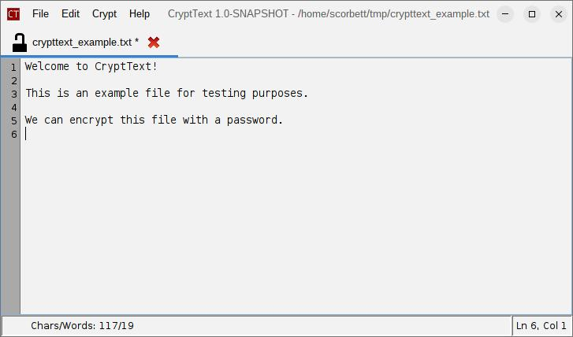

# CryptText

## What is this?

CryptText is a user-friendly text editor that provides simple encryption and decryption options.
Users can easily encrypt text files using a password, without knowing or caring about
the underlying encryption details.




## How do I get it?

### Option 1: Installer tarball

If you are running on Linux, and have Java 17 or higher installed, you can download the installer tarball:

- [CryptText Installer](TODO insert download link before V1 release)

This is the best option, as you get an installer script that sets everything up for you:

- desktop shortcut
- shell integration (for right-clicking on text files and selecting "Open with CryptText")
- launcher script in your PATH (so you can run `crypttext` from the terminal)
- uninstaller script that removes all of the above

### Option 2: Build from source

You can clone the CryptText repository from GitHub and build it with maven:

```bash
git clone https://github.com/scorbo2/crypttext.git
cd crypttext
mvn clean package

# Run the executable jar:
cd target
java -jar crypttext-1.0.0.jar
```

## User guide

### General usage

CryptText can be used as a regular text editor. Files can be opened or created in editor tabs.

### Encrypting

At any time, you can select "Encrypt" from the Crypt menu, or hit Ctrl+D (by default). This brings
up the "enter password" prompt, where you choose the password to use for encryption:


The text file is then encrypted. The encrypted payload is base64-encoded and embedded into a simple
wrapper file - this allows you to open the file in any other text editor, and see that it is encrypted
(instead of just seeing gibberish). The wrapper file provides instructions for how to get CryptText
to decrypt the file.

### Decrypting

When you open an encrypted wrapper file, you can hit Ctrl+D (or select "Decrypt" from the Crypt menu)
to bring up the password prompt. If you enter the correct password, the file will be decrypted in memory
and displayed in the editor. The contents on disk remain encrypted! Even if you make changes to the decrypted
text and save the file, the contents on disk will still be encrypted, using the same password you entered.

The general workflow is such that if text was loaded from an encrypted file, then the text content
will stay encrypted on disk. This is to prevent accidental saving of unencrypted text. If you really wish to save the
decrypted text, you must explicitly choose "Save unencrypted" from the File menu.
You will be prompted for confirmation before proceeding:


### Configuration options

CryptText has many options for changing the look and the behavior of the application:


You can also override the Look and Feel and select custom color themes. Here is the "Matrix" theme, for example:


Additionally: there are two built-in application extensions:

- StatusBar: Shows the current line and column number, and other optional file information, such as date, size, and word
  count.
- DirTree: Shows a directory tree on the left that allows you to navigate the filesystem and double-click files to open
  them.

## Extending CryptText

CryptText is built on the `swing-extras` library, which has a built-in application extension mechanism.
This means that you can write your own CryptText extensions in Java, package them into a jar file,
and load them dynamically at runtime! Refer to the Javadocs for `CryptTextExtension` and `CryptTextExtensionManager`
for more information, or refer to the [swing-extras book](https://www.corbett.ca/swing-extras-book/) and its
section on application extensions.

## License

CryptText is licensed under the MIT License. See the [LICENSE](LICENSE) file for details.

## Version history

Refer to the [Release Notes](src/main/resources/ca/corbett/crypttext/ReleaseNotes.txt) for a detailed version history.
